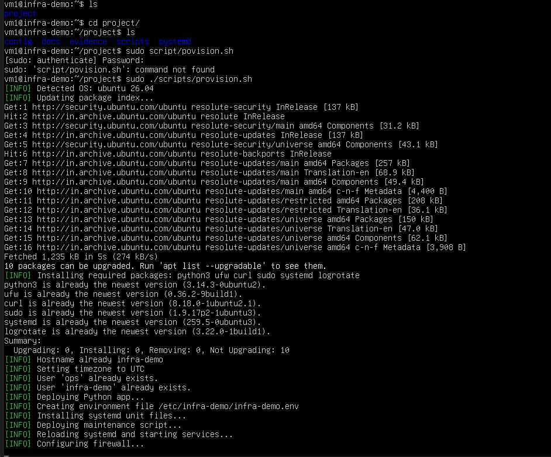
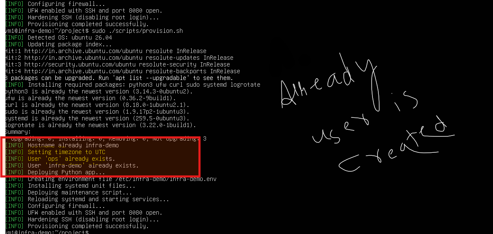
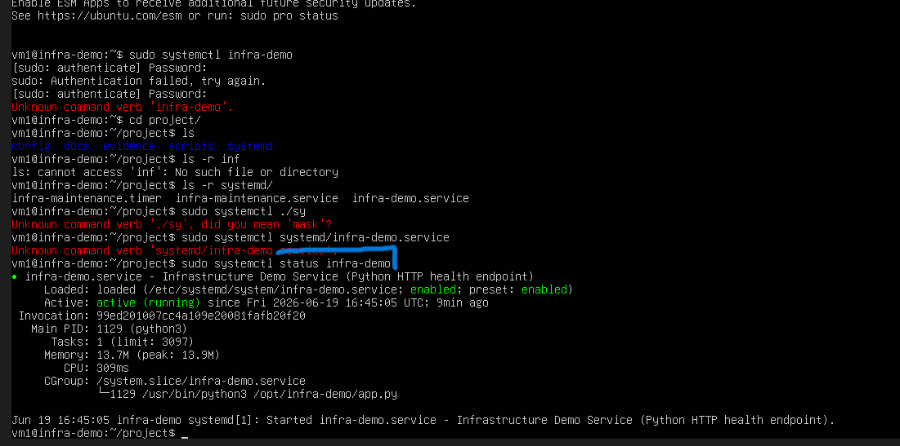
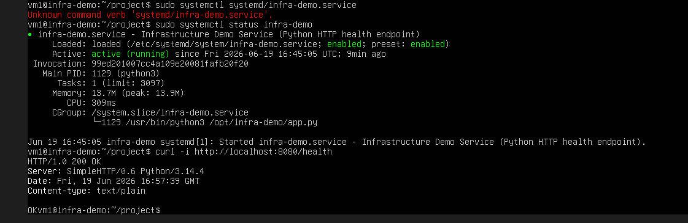
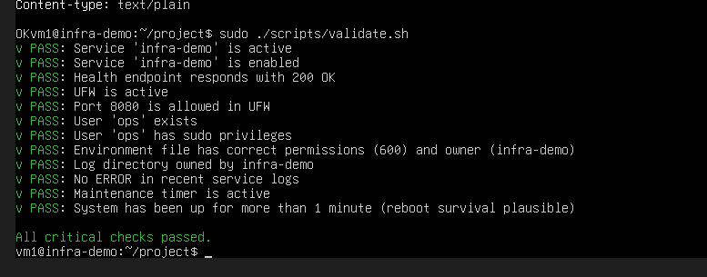

#USE OF AI 

used LLM - chatGpt , DeepSeek and Cloude

it helps to write better and error free code 
- i used it as senior dev  for answers of questions like how servive can be build persistand 
- along with various bash examples 

#Using ubuntu 26.4 LATEST

## Runnig provision scripts 

## Running Again provision scripts 

- script didnt create new user 

## Reboting System to test that proviosion script is working or not 

## After reboting pyton server is still active (infra ) 

## Testing CURL to get response 

## Testing Validation Script

